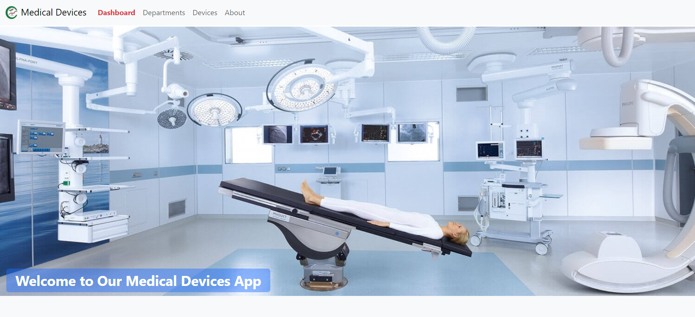
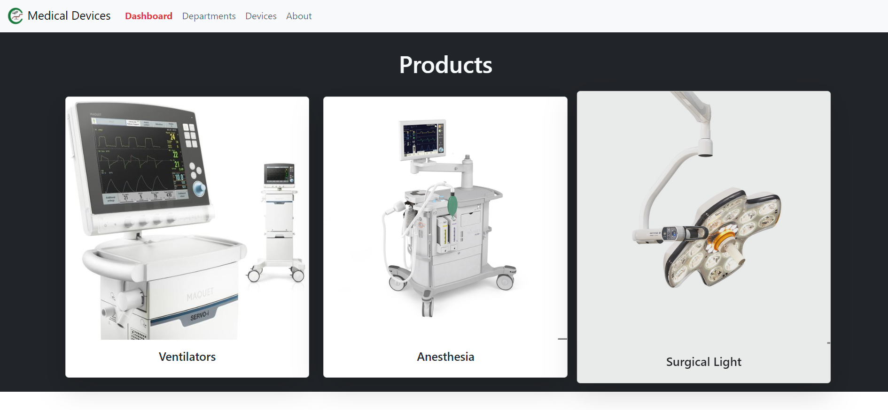
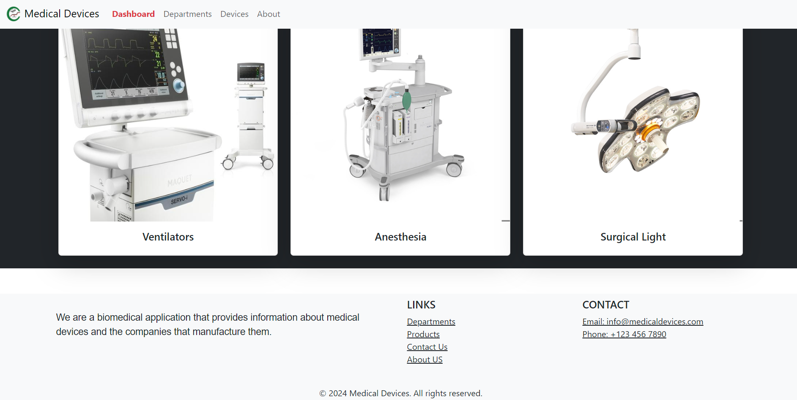

# Biomedical Company and Devices Application

## Introduction

The **Biomedical Company and Devices Application** The website is built using Flask, a lightweight Python web framework, which allows for rapid development and dynamic functionality. We have used Bootstrap 5 for responsive front-end styling, ensuring the design is clean and functional across devices. The site features a dynamic structure that enables admin users to easily add, delete, and update departments, devices, and models, making the platform adaptable for various companies in the medical device industry. This flexibility is key for scaling and managing diverse sets of data. This dynamic functionality provides a flexible solution for companies that need to manage a large array of medical devices and models, offering a personalized interface for each company.

### Deployed Site
You can access the deployed site (Not deployed yet).

### Blog Article
Read about the journey of creating this project in my [final project blog article](YOUR_BLOG_ARTICLE_LINK).

### Author
- **[Mohamed Maher](https://www.linkedin.com/in/mohammed-maher-591b62a4/)**
- **[Peter Naguib](https://www.linkedin.com/)**
## Installation

To run the application locally, follow these steps:

1. **Clone the repository:**
   ```bash
   git clone https://github.com/MoMaherB/Medical-Devices_v2/
   cd biomedical_app

2. **Set up a virtual environment:**
	 ```bash
	python -m venv venv
	source venv/bin/activate  # On Windows use `venv\Scripts\activate`


3. **Install required packages:**
	 ```bash
	pip install -r requirements.txt

4. **Set up the database:**
	 ```bash
	python3 create_database.py

5. **Set up the database:**
	 ```bash
	python3 app.py


### Usage
	Navigate to http://127.0.0.1:5000 in your web browser.
	Log in with your credentials or create a new user.
	Access the dashboard to manage departments, devices, and models.

### Contributing
	Contributions are welcome! If you have suggestions or improvements, please fork the repository and create a pull request. For major changes, please open an issue to discuss what you would like to change.

	1- Fork the project.
	2- Create your feature branch (git checkout -b feature/AmazingFeature).
	3- Commit your changes (git commit -m 'Add some AmazingFeature').
	4- Push to the branch (git push origin feature/AmazingFeature).
	5- Open a pull request.

### Related Projects
	Another Project - Static Version of our website https://github.com/MoMaherB/Biomedical_Devices.
	Similar Application - https://www.getinge.com/me/.

## Technical Details

This project is built using Flask, a micro web framework for Python, which allows for rapid development of web applications. Flask's lightweight nature and flexibility made it an excellent choice for this application, allowing for easy integration of various components.

### Key Technologies Used

- **Flask**: The core framework used to build the web application. Flask handles routing, request handling, and session management.
- **Flask-SQLAlchemy**: An extension for Flask that simplifies database interactions using SQLAlchemy, allowing for easy model definition and querying of data.
- **Flask-WTF**: Used for form handling in Flask, providing a simple way to create and validate forms, including file uploads.
- **Flask-Login**: This extension manages user sessions, providing features for user authentication and access control.
- **Bootstrap**: A front-end framework utilized to design the user interface, providing responsive layout and styling components that enhance the user experience. Bootstrap ensures that the application is visually appealing and accessible on various devices.
- **Pillow**: A Python Imaging Library fork that allows for image processing tasks, such as resizing images after they are uploaded.
- **Markdown**: Used to render formatted text descriptions for departments and devices, enhancing the readability of the content displayed in the application.

### Application Structure

The application follows a modular structure, separating models, forms, and routes to maintain clarity and organization. The database models include `User`, `Department`, `Device`, and `Model`, each with relationships to facilitate data retrieval.

- **User Model**: Handles user authentication with fields for username and password.
- **Department Model**: Contains information about various medical departments and their descriptions.
- **Device Model**: Represents medical devices and includes descriptions and relationships to departments.
- **Model Class**: Contains specific model information related to devices, including image handling for better visual representation.

### User Experience

The application features a user-friendly interface built with Bootstrap, ensuring that users can easily navigate through departments, devices, and models. The dashboard welcomes the user and provides quick access to view and manage the various components of the application.

### Future Enhancements

In future iterations, I envision adding features such as:
- User roles and permissions to limit access to certain sections of the application.
- More comprehensive image handling and optimization for faster loading times.

This project not only showcases my technical skills in Flask and Bootstrap but also reflects our journey as a developers, addressing challenges and continuously iterating on the application for improvement.





